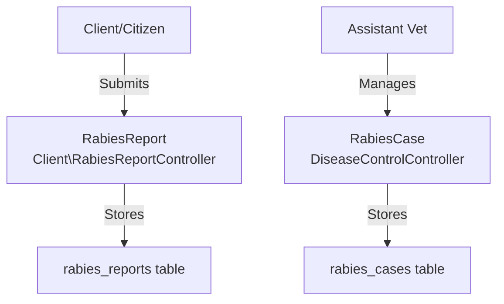

# Plan: Connect Rabies Reports to Rabies Cases & Enhance UI

## Overview
Two-fold integration:
1. **Connect Reports to Cases**: Allow staff to convert Rabies Bite Reports to Rabies Cases for follow-up
2. **Enhance UI**: Improve the Rabies Cases Management interface in Assistant Veterinary Dashboard

## Current Architecture



---

## Part 1: Connect Rabies Reports to Rabies Cases

### Implementation Steps

#### 1. Database Schema
- Add `rabies_report_id` column to `rabies_cases` table (nullable, foreign key)

#### 2. Model Relationships
- Update `RabiesReport`: Add `rabiesCase()` hasOne relationship
- Update `RabiesCase`: Add `rabiesReport()` belongsTo relationship

#### 3. Controller Methods (DiseaseControlController)
- `createRabiesCaseFromReport(RabiesReport $rabiesReport)` - Show pre-filled form
- `storeRabiesCaseFromReport(Request $request, RabiesReport $rabiesReport)` - Save new case

#### 4. Routes (web.php)
- `GET /rabies-bite-reports/{rabiesReport}/create-case` - Form with pre-filled data
- `POST /rabies-bite-reports/{rabiesReport}/store-case` - Save case

#### 5. View Updates (show.blade.php)
- Add "Create Rabies Case" button in sidebar
- Add modal with pre-filled form

---

## Part 2: Enhance Rabies Cases Management UI

### Current Issues in Assistant Veterinary Dashboard
1. Rabies Cases stats use wrong table (`AnimalBiteReport` instead of `RabiesCase`)
2. Quick Actions only show Bite Reports (not Rabies Cases)
3. Recent Bite Reports section doesn't include Rabies Bite Reports
4. No link to Rabies Bite Reports in the dashboard
5. Missing Rabies Reports stats in the dashboard

### UI Enhancement Plan

#### 1. Update Assistant Veterinary Dashboard (`dashboard/assistant-veterinary.blade.php`)

**Stats Cards - Replace with proper data:**
```
- Total Rabies Cases (from RabiesCase table)
- Open Cases (status = 'open')
- Under Investigation (status = 'under_investigation')  
- Closed Cases (status = 'closed')
```

**Quick Actions - Add Rabies Bite Reports:**
```
- Rabies Cases (link to assistant-vet.rabies-cases.index)
- Rabies Bite Reports (link to assistant-vet.rabies-bite-reports.index) [NEW]
- Bite Reports (existing)
```

**Add Rabies Bite Reports Stats Section:**
```
- Total Rabies Bite Reports
- Pending Review
- Under Review
- Resolved
```

#### 2. Update Rabies Cases List View (`dashboard/rabies-cases.blade.php`)

**Add "Create Rabies Case" button:**
- Link to proper create form

**Table - Add more columns:**
```
- Case ID (case_number)
- Case Type (positive/probable/suspect/negative)
- Species
- Animal Name
- Owner Name
- Incident Date
- Location (Barangay)
- Status
- Actions (View/Edit)
```

**Add case type badges with colors:**
- Positive: Red
- Probable: Yellow
- Suspect: Blue
- Negative: Green

#### 3. Update Rabies Cases Show View (`rabies-cases/show.blade.php`)

**Enhance display:**
- Add case type badge with color
- Add barangay map reference
- Add linked Rabies Report info (if converted)
- Add action buttons (Edit, Update Status)
- Add timeline of case status changes

---

## Data Mapping: RabiesReport → RabiesCase

| RabiesReport Field | RabiesCase Field | Notes |
|-------------------|------------------|-------|
| `patient_name` | `animal_name` | As identifier |
| `patient_barangay_id` | `barangay_id` | Location |
| `incident_date` | `incident_date` | Same date |
| `animal_species` | `species` | Map: Dog→dog, Cat→cat, Others→other |
| `animal_owner_name` | `owner_name` | Same |
| `nature_of_incident` | `remarks` | Store in remarks |
| `exposure_category` | `case_type` | Default to 'suspect' |
| `animal_status` | - | Store in remarks |
| `animal_vaccination_status` | - | Store in remarks |

---

## Files to Modify

### New Files
1. `database/migrations/2026_04_01_000002_add_rabies_report_id_to_rabies_cases_table.php`

### Existing Files - Model Relationships
2. `app/Models/RabiesReport.php` - Add hasOne rabiesCase()
3. `app/Models/RabiesCase.php` - Add belongsTo rabiesReport()

### Existing Files - Controller
4. `app/Http/Controllers/DiseaseControlController.php` - Add create/store methods

### Existing Files - Routes
5. `routes/web.php` - Add routes for conversion

### Existing Files - Views
6. `resources/views/dashboard/assistant-veterinary.blade.php` - Enhance dashboard
7. `resources/views/dashboard/rabies-cases.blade.php` - Enhance list view
8. `resources/views/dashboard/rabies-bite-reports/show.blade.php` - Add convert button
9. `resources/views/rabies-cases/show.blade.php` - Add linked report info

---

## Success Criteria

### Part 1: Connection
- [ ] Assistant Vet can view Rabies Bite Reports list
- [ ] "Create Rabies Case" button appears on Report details
- [ ] Button opens form pre-filled with report data
- [ ] Submitting creates new RabiesCase linked to Report
- [ ] Report status updates when converted

### Part 2: UI Enhancement
- [ ] Assistant Veterinary Dashboard shows correct Rabies Case stats
- [ ] Dashboard shows Rabies Bite Reports section
- [ ] Quick Actions include links to both Reports and Cases
- [ ] Rabies Cases list shows all relevant columns with badges
- [ ] Rabies Cases show view displays all case information
